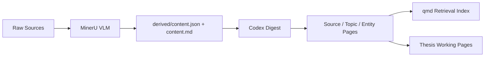

# General Knowledge Base

> An Obsidian-style knowledge vault framework for source digestion, structured knowledge pages, and thesis-oriented writing workflows.

[](https://github.com/1635338825-prog/general-knowledge-base/releases)
[](https://github.com/1635338825-prog/general-knowledge-base/commits/master)
[](https://github.com/1635338825-prog/general-knowledge-base)
[](https://github.com/1635338825-prog/general-knowledge-base/blob/master/LICENSE)

`general-knowledge-base` 是一个通用个人知识库 skill，用于把论文、PDF、Word、PPT、Markdown、项目文档和网页转存资料沉淀为可检索、可复用的知识资产。

它支持两种工作模式：

- `General Mode`：通用资料知识库，聚焦来源页、主题页、实体页
- `Thesis Mode`：论文知识库，额外提供主线评估、文献桥接、识别设计和章节草稿工作面

## At a Glance

| Capability | What it does |
| --- | --- |
| `MinerU VLM` | 解析 PDF / PPT / DOCX 等资料，生成 `content.json` 和 `content.md` |
| `Codex` | 把解析结果消化为 `digest.json`，并驱动来源页、主题页、实体页和写作页 |
| `qmd` | 建立本地检索与索引，支持自然语言查询和证据回查 |
| `Obsidian-style vault` | 承载最终的人类可读页面与长期维护结构 |

## Why This Project

- 把原始资料稳定转成结构化知识，而不是散落的 PDF 和笔记
- 让来源 digest、主题页、实体页和检索索引保持统一契约
- 在论文场景下，把“知识沉淀”继续推进为“写作工作流”
- 保持脚本职责清晰：解析、编排、验证、重建、检索，而不是启发式乱抽取

## Architecture



## Modes

### General Mode

适合：

- 个人学习资料沉淀
- 项目知识管理
- 方法论与概念整理
- 长期个人知识库维护

核心结构：

```text
raw/
derived/
wiki/sources/
wiki/topics/
wiki/entities/
```

### Thesis Mode

适合：

- 论文选题推进
- 文献综述组织
- 识别策略整理
- 章节草稿推进

额外结构：

```text
wiki/core/
wiki/literature/
wiki/identification/
wiki/drafts/
```

这不是简单加目录，而是把论文主线、桥接文献、识别威胁、稳健性计划和章节草稿显式纳入知识库。

## Quick Start

### 1. Create a General Knowledge Vault

```powershell
python .\scripts\wiki_task.py init-vault --vault D:\MyWiki --title "我的知识库" --purpose "用于沉淀学习、研究、项目和长期资料"
```

### 2. Upgrade It to a Thesis Knowledge Vault

```powershell
python .\scripts\wiki_task.py init-thesis-workspace --vault D:\MyWiki
```

### 3. Ingest a Source

```powershell
python .\scripts\wiki_task.py ingest-file --file "C:\path\document.pdf" --vault D:\MyWiki --tag 资料
```

### 4. Prepare and Apply a Digest

```powershell
python .\scripts\wiki_task.py prepare-source --vault D:\MyWiki --source-id <source-id>
python .\scripts\wiki_task.py apply-digest --vault D:\MyWiki --source-id <source-id> --digest-file "C:\path\digest.json"
```

### 5. Rebuild and Query

```powershell
python .\scripts\wiki_task.py rebuild --vault D:\MyWiki
python .\scripts\wiki_task.py query --vault D:\MyWiki --question "这个知识库里关于某个主题有哪些内容？" --limit 5
```

## Thesis Mode Starter Pages

`init-thesis-workspace` 会初始化以下写作工作面：

- `wiki/core/`
  - `主线缺口评估.md`
  - `论文主线与章节地图.md`
  - `当前最强证据包.md`
  - `下一批应补文献.md`
- `wiki/literature/`
  - `桥接文献清单.md`
  - `候选文献池.md`
  - `文献作用分组.md`
- `wiki/identification/`
  - `识别策略卡.md`
  - `识别威胁卡.md`
  - `稳健性计划卡.md`
  - `异质性计划卡.md`
- `wiki/drafts/`
  - `摘要草稿.md`
  - `文献综述草稿.md`
  - `研究设计草稿.md`
  - `实证结果草稿.md`
  - `机制分析草稿.md`

## Workflow

### Source Digestion

1. 用 `ingest-file` 或 `ingest-folder` 解析原始资料
2. 生成 `derived/<source-id>/content.json` 和 `content.md`
3. 用 `prepare-source` 生成 Codex digest bundle
4. 用 `apply-digest` 写入 `digest.json` 并渲染来源页

### Topic and Entity Upgrade

1. 用 `prepare-topic` / `prepare-entity` 生成聚合 bundle
2. 用 `apply-topic` / `apply-entity` 写入 digest 并更新页面

### Retrieval and Audit

1. 用 `rebuild` 从现有 digest 重建页面
2. 用 `query` 做自然语言检索
3. 用 `audit-readiness` / `audit-vault` 检查缺口与质量问题

## Rules

- PDF 解析必须使用 `MinerU VLM`
- `content.json` 是主要消化输入
- `parsed_only` 是合法中间状态
- `rebuild` 不能重新跑 MinerU
- 高价值实体应升级成独立实体页，而不只是停留在来源 digest 中
- 所有 Markdown / JSON 一律显式按 `UTF-8` 读写，不依赖系统默认编码
- 在 Windows / PowerShell 中读取 Markdown 时，必须显式指定 `UTF-8`

## Repository Layout

```text
general-knowledge-base/
  README.md
  SKILL.md
  LICENSE
  CONTRIBUTING.md
  agents/
    openai.yaml
  references/
    command-cookbook.md
    io-contract.md
    knowledge-schema.md
    purpose-taxonomy.md
    retrieval-guidelines.md
    thesis-mode.md
  scripts/
    wiki_task.py
```

## Key Files

- [SKILL.md](./SKILL.md)
  Main operating instructions for the skill
- [references/knowledge-schema.md](./references/knowledge-schema.md)
  Source / topic / entity / thesis working page contract
- [references/purpose-taxonomy.md](./references/purpose-taxonomy.md)
  Purpose-relative role taxonomy
- [references/thesis-mode.md](./references/thesis-mode.md)
  Thesis-mode starter structure and usage
- [scripts/wiki_task.py](./scripts/wiki_task.py)
  Task runner for init, ingest, digest, rebuild, query, and thesis scaffolding
- [CONTRIBUTING.md](./CONTRIBUTING.md)
  Contribution and repository update guidelines

## Releases

- [Releases](https://github.com/1635338825-prog/general-knowledge-base/releases)
- [v1.0.0 - Thesis Knowledge Base Mode](https://github.com/1635338825-prog/general-knowledge-base/releases/tag/v1.0.0)
